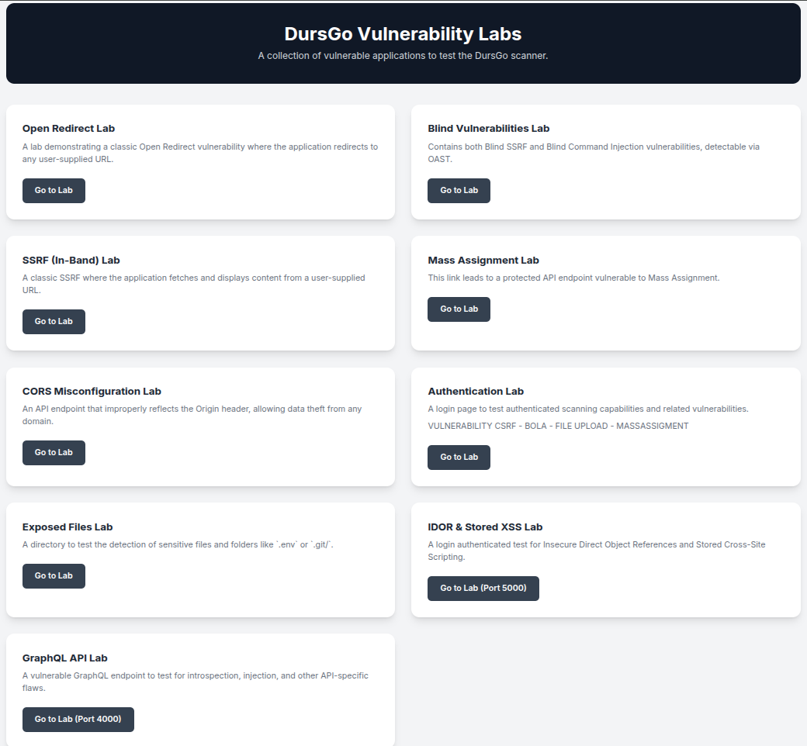

# DursGo Vulnerability Labs

A collection of vulnerable applications to test the DursGo scanner.

---

This repository contains two different vulnerability lab applications, each with its own configuration. Here is how to run both using Docker.

## Lab Descriptions

<p align="center">
  
</p>

The following labs are available in this collection:

-   **Open Redirect Lab**
    -   A lab demonstrating a classic Open Redirect vulnerability where the application redirects to any user-supplied URL.

-   **Blind Vulnerabilities Lab**
    -   Contains both Blind SSRF and Blind Command Injection vulnerabilities, detectable via OAST.

-   **SSRF (In-Band) Lab**
    -   A classic SSRF where the application fetches and displays content from a user-supplied URL.

-   **Mass Assignment Lab**
    -   This link leads to a protected API endpoint vulnerable to Mass Assignment.

-   **CORS Misconfiguration Lab**
    -   An API endpoint that improperly reflects the Origin header, allowing data theft from any domain.

-   **Authentication Lab**
    -   A login page to test authenticated scanning capabilities and related vulnerabilities. (Vulnerabilities: CSRF, BOLA, File Upload, Mass Assignment).

-   **Exposed Files Lab**
    -   A directory to test the detection of sensitive files and folders like `.env` or `.git/`.

-   **IDOR & Stored XSS Lab**
    -   A login authenticated test for Insecure Direct Object References and Stored Cross-Site Scripting.

-   **GraphQL API Lab**
    -   A vulnerable GraphQL endpoint to test for introspection, injection, and other API-specific flaws.

## 1. PHP Lab Application (`index-vuln`)

This application is a PHP-based vulnerability lab and serves as the main dashboard for all labs.

> **Important:** The main page of this application (`http://localhost:8088`) contains links to all labs, including those running on ports 5000 and 4000. To ensure all links work, you must run **both** applications (`index-vuln` and `index-vuln-2`) simultaneously.

### Requirements
- Docker
- Docker Compose

### How to Run
1.  Open a terminal and navigate to the `index-vuln` directory:
    ```bash
    cd index-vuln
    ```

2.  Run the following command to build and start the Docker container:
    ```bash
    docker-compose up --build -d
    ```
    This command will run the application in the background.

3.  Once the container is running, the application will be accessible at:
    [http://localhost:8088](http://localhost:8088)

### How to Stop
To stop the application, run the following command from within the `index-vuln` directory:
```bash
docker-compose down
```

---

## 2. Python & Node.js Lab Application (`index-vuln-2`)

This application consists of two services: a Flask-based web application (Python) and a Node.js-based GraphQL API.

### Requirements
- Docker
- Docker Compose

### How to Run
1.  Open a terminal and navigate to the `index-vuln-2` directory:
    ```bash
    cd index-vuln-2
    ```

2.  Run the following command to build and start both services:
    ```bash
    docker-compose up --build -d
    ```

3.  Once the containers are running, the services will be accessible at:
    - **Web Application (Flask)**: [http://localhost:5000](http://localhost:5000)
    - **GraphQL API (Node.js)**: [http://localhost:4000](http://localhost:4000)

### Credentials for Web Application (Port 5000)
The database is initialized with the following users:

- **Admin User**
  - **Username:** `admin`
  - **Password:** `admin123`

- **Regular User**
  - **Username:** `user1`
  - **Password:** `password123`

### How to Stop
To stop both services, run the following command from within the `index-vuln-2` directory:
```bash
docker-compose down
